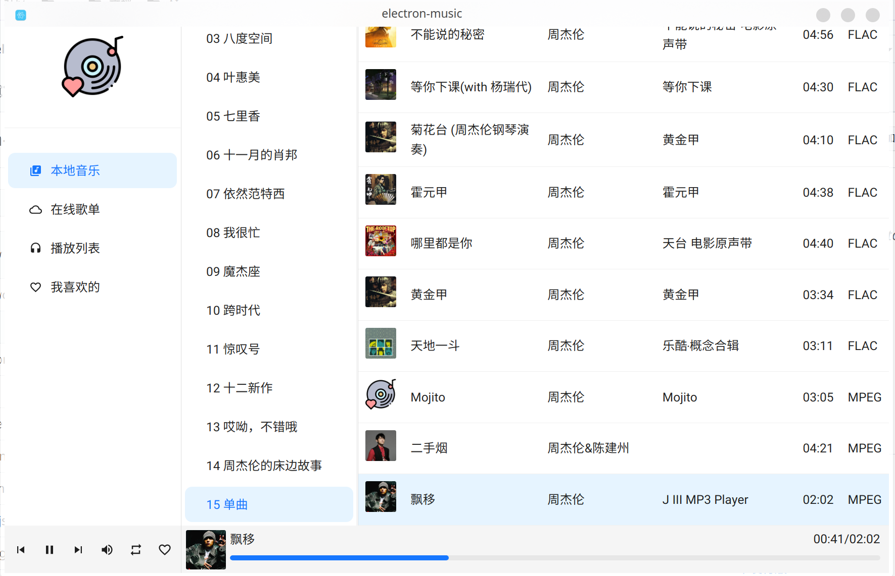
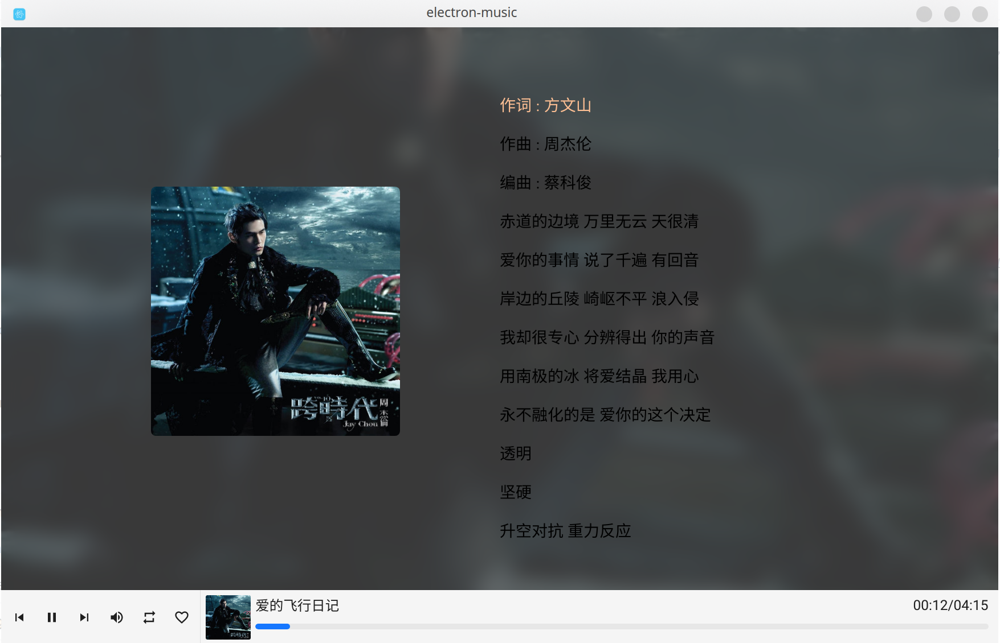

# ElectronMusic

一个基于 Electron + React 的本地音乐播放器，支持歌词展示、专辑封面、歌曲信息解析。





## 功能

- 本地音乐目录管理，支持多目录添加/删除
- 自动解析歌曲元数据（标题、艺术家、专辑、封面）
- 歌词下载与滚动展示
- 播放控制：上一首 / 下一首 / 进度条拖拽
- 当前播放高亮，切换页面后状态保持

## 技术栈

| 层级 | 技术 |
|------|------|
| 桌面框架 | Electron 41 |
| 前端 | React 19 + React Router 7 |
| UI | Ant Design 6 + MUI 9 |
| 构建 | Vite 5 + vite-plugin-electron |
| 元数据解析 | music-metadata 11 |

## 快速开始

**环境要求：** Node.js 20+

```bash
npm install
npm run dev
```

## 构建

```bash
npm run build
```

产物输出至 `release/` 目录，支持 Windows（zip + nsis）、macOS（dmg）、Linux（AppImage + tar.gz）。

也可以通过打 tag 触发 GitHub Actions 自动构建发布：

```bash
git tag v1.2.0
git push origin v1.2.0
```

## Changelog

见 [.github/changelog.md](.github/changelog.md)
